# 开发者指南

本文档为WhatsApp语言增强层项目的开发者提供详细的开发指南。

## 🚀 快速开始

### 环境准备

1. **安装Node.js**
   ```bash
   # 推荐使用nvm管理Node.js版本
   curl -o- https://raw.githubusercontent.com/nvm-sh/nvm/v0.39.0/install.sh | bash
   nvm install 20
   nvm use 20
   ```

2. **安装依赖**
   ```bash
   npm install
   ```

3. **启动开发服务器**
   ```bash
   npm run dev
   ```

### 开发工具配置

#### VS Code
推荐安装以下VS Code扩展：
- ES7+ React/Redux/React-Native snippets
- Prettier - Code formatter
- ESLint
- TypeScript Importer
- Auto Rename Tag
- Path Intellisense
- GitLens
- TODO Highlight

#### Git配置
```bash
git config --global core.autocrlf false
git config --global core.eol lf
```

## 🏗️ 架构概览

### Electron架构
```
┌─────────────────┐    IPC     ┌─────────────────┐
│   Main Process  │ ←───────→ │ Renderer Process│
│   (Node.js)     │           │   (React)       │
└─────────────────┘           └─────────────────┘
         ↑                             ↑
         │                             │
    File System                    DOM API
         │                             │
         ↓                             ↓
   ┌─────────────────┐    contextBridge    ┌─────────────────┐
   │ Preload Script  │ ←─────────────────→ │   Renderer API  │
   │   (Secure)      │                     │   (Exposed)     │
   └─────────────────┘                     └─────────────────┘
```

### 目录结构详解

#### 主进程 (`src/main/`)
- **main.ts**: 应用入口点
- 窗口管理
- 系统集成
- 文件系统访问
- IPC通信处理

#### 渲染进程 (`src/renderer/`)
- **index.tsx**: 渲染进程入口
- **App.tsx**: 根组件
- UI组件
- 状态管理
- 用户交互

#### 预加载脚本 (`src/preload/`)
- **preload.ts**: 安全的API暴露
- 主进程和渲染进程桥接
- 安全验证

#### 共享代码 (`src/shared/`)
- **types/**: TypeScript类型定义
- **utils/**: 工具函数
- **constants/**: 常量定义
- **config/**: 配置管理

## 🔧 开发工作流

### 1. 功能开发流程

```mermaid
graph LR
    A[创建分支] --> B[编写代码]
    B --> C[运行测试]
    C --> D[代码检查]
    D --> E[提交代码]
    E --> F[创建PR]
    F --> G[代码审查]
    G --> H[合并代码]
```



### 2. 创建新功能

1. **创建功能分支**
   ```bash
   git checkout -b feature/new-feature
   ```

2. **编写代码**
   - 遵循TypeScript严格模式
   - 使用ES6+语法
   - 编写单元测试
   - 更新文档

3. **运行测试**
   ```bash
   npm run test:watch
   ```

4. **代码检查**
   ```bash
   npm run lint:fix
   npm run type-check
   ```

5. **提交代码**
   ```bash
   git add .
   git commit -m "feat: add new feature"
   ```

### 3. 调试技巧

#### 主进程调试
```bash
# 启动主进程调试
npm run start:dev -- --inspect=5858
```

#### 渲染进程调试
- 使用Chrome DevTools
- VS Code调试配置
- React DevTools

#### 日志调试
```typescript
import { logger } from '@/shared/utils';

logger.debug('Debug message');
logger.info('Info message');
logger.warn('Warning message');
logger.error('Error message');
```

## 📝 编码规范

### TypeScript规范

#### 类型定义
```typescript
// ✅ 好的做法
interface User {
  id: string;
  name: string;
  email: string;
  createdAt: Date;
}

// ❌ 避免使用any
const user: any = {};

// ✅ 使用具体类型
const user: User = {
  id: '1',
  name: 'John',
  email: 'john@example.com',
  createdAt: new Date(),
};
```

#### 函数定义
```typescript
// ✅ 明确的返回类型
function getUserById(id: string): Promise<User | null> {
  return userService.findById(id);
}

// ✅ 使用箭头函数
const createUser = async (userData: CreateUserDto): Promise<User> => {
  return userService.create(userData);
};
```

### React组件规范

#### 函数组件
```typescript
interface Props {
  title: string;
  onSubmit: (data: FormData) => void;
  children?: React.ReactNode;
}

const MyComponent: React.FC<Props> = ({ title, onSubmit, children }) => {
  const [isLoading, setIsLoading] = useState(false);

  const handleSubmit = useCallback(
    async (data: FormData) => {
      setIsLoading(true);
      try {
        await onSubmit(data);
      } finally {
        setIsLoading(false);
      }
    },
    [onSubmit]
  );

  return (
    <div className="my-component">
      <h1>{title}</h1>
      {children}
    </div>
  );
};

export default MyComponent;
```

#### Hooks使用
```typescript
// ✅ 自定义Hook
const useUserData = (userId: string) => {
  const [user, setUser] = useState<User | null>(null);
  const [loading, setLoading] = useState(true);
  const [error, setError] = useState<string | null>(null);

  useEffect(() => {
    const fetchUser = async () => {
      try {
        setLoading(true);
        const userData = await userService.findById(userId);
        setUser(userData);
      } catch (err) {
        setError(err.message);
      } finally {
        setLoading(false);
      }
    };

    fetchUser();
  }, [userId]);

  return { user, loading, error };
};
```

### 样式规范

#### CSS模块化
```css
/* App.module.css */
.container {
  display: flex;
  flex-direction: column;
  padding: 1rem;
}

.title {
  font-size: 1.5rem;
  font-weight: 600;
  color: var(--color-primary);
}
```

```typescript
import styles from './App.module.css';

const App = () => (
  <div className={styles.container}>
    <h1 className={styles.title}>Title</h1>
  </div>
);
```

#### CSS变量
```css
/* styles/variables.css */
:root {
  --color-primary: #2c3e50;
  --color-secondary: #34495e;
  --color-accent: #3498db;
  --spacing-sm: 0.5rem;
  --spacing-md: 1rem;
  --spacing-lg: 2rem;
}
```

## 🧪 测试策略

### 单元测试
```typescript
// utils.test.ts
import { formatDate, validateEmail } from './utils';

describe('Utils', () => {
  describe('formatDate', () => {
    it('should format date correctly', () => {
      const date = new Date('2024-01-01');
      expect(formatDate(date)).toBe('2024-01-01');
    });
  });

  describe('validateEmail', () => {
    it('should validate correct email', () => {
      expect(validateEmail('test@example.com')).toBe(true);
    });

    it('should reject invalid email', () => {
      expect(validateEmail('invalid-email')).toBe(false);
    });
  });
});
```

### 组件测试
```typescript
// MyComponent.test.tsx
import { render, screen, fireEvent } from '@testing-library/react';
import MyComponent from './MyComponent';

describe('MyComponent', () => {
  it('should render title correctly', () => {
    render(<MyComponent title="Test Title" onSubmit={jest.fn()} />);
    expect(screen.getByText('Test Title')).toBeInTheDocument();
  });

  it('should call onSubmit when form is submitted', () => {
    const onSubmit = jest.fn();
    render(<MyComponent title="Test Title" onSubmit={onSubmit} />);

    fireEvent.click(screen.getByRole('button', { name: /submit/i }));
    expect(onSubmit).toHaveBeenCalled();
  });
});
```

### 集成测试
```typescript
// integration/app.test.ts
import { app, BrowserWindow } from 'electron';
import { application } from '../main';

describe('Application Integration', () => {
  let window: BrowserWindow;

  beforeAll(async () => {
    await app.whenReady();
    window = application.getMainWindow();
  });

  afterAll(async () => {
    await app.quit();
  });

  it('should create main window', () => {
    expect(window).toBeDefined();
    expect(window.isVisible()).toBe(true);
  });
});
```

## 🔌 IPC通信

### 主进程IPC处理
```typescript
// main/ipc/handlers.ts
import { ipcMain } from 'electron';

export const setupIpcHandlers = () => {
  ipcMain.handle('user:getById', async (_, id: string) => {
    return userService.findById(id);
  });

  ipcMain.handle('user:create', async (_, userData: CreateUserDto) => {
    return userService.create(userData);
  });
};
```

### 预加载脚本API暴露
```typescript
// preload/api.ts
import { contextBridge, ipcRenderer } from 'electron';

export const userAPI = {
  getById: (id: string): Promise<User> => ipcRenderer.invoke('user:getById', id),
  create: (userData: CreateUserDto): Promise<User> =>
    ipcRenderer.invoke('user:create', userData),
};

contextBridge.exposeInMainWorld('userAPI', userAPI);
```

### 渲染进程API使用
```typescript
// renderer/hooks/useUser.ts
export const useUser = () => {
  const getUserById = async (id: string): Promise<User | null> => {
    try {
      return await window.userAPI.getById(id);
    } catch (error) {
      console.error('Failed to get user:', error);
      return null;
    }
  };

  return { getUserById };
};
```

## 🔄 状态管理

### 本地状态
```typescript
// 使用useState和useReducer
const [state, setState] = useState(initialState);
const [state, dispatch] = useReducer(reducer, initialState);
```

### 全局状态
```typescript
// 使用Context API
const AppContext = createContext<AppContextType>({} as AppContextType);

export const AppProvider: React.FC<{ children: React.ReactNode }> = ({ children }) => {
  const [state, setState] = useState(initialState);

  return (
    <AppContext.Provider value={{ state, setState }}>
      {children}
    </AppContext.Provider>
  );
};
```

## 📦 构建和部署

### 开发构建
```bash
npm run build:dev
```

### 生产构建
```bash
npm run build
```

### 打包应用
```bash
# 所有平台
npm run dist

# 特定平台
npm run dist:win
npm run dist:mac
npm run dist:linux
```

### 环境变量
```bash
# .env.development
NODE_ENV=development
LOG_LEVEL=debug

# .env.production
NODE_ENV=production
LOG_LEVEL=warn
```

## 🐛 常见问题

### Q: 如何调试主进程？
A: 使用Chrome DevTools或VS Code调试配置：
```bash
npm run start:dev -- --inspect=5858
```

### Q: 如何处理异步操作？
A: 使用async/await和Promise：
```typescript
const fetchData = async () => {
  try {
    const data = await api.getData();
    setData(data);
  } catch (error) {
    setError(error.message);
  }
};
```

### Q: 如何优化应用性能？
A:
- 使用React.memo优化组件渲染
- 使用useMemo和useCallback优化计算
- 代码分割和懒加载
- 优化Webpack配置

### Q: 如何处理安全性？
A:
- 禁用Node.js集成
- 使用contextBridge
- 配置CSP
- 验证所有输入

## 📚 更多资源

- [Electron官方文档](https://www.electronjs.org/docs)
- [React官方文档](https://reactjs.org/docs)
- [TypeScript官方文档](https://www.typescriptlang.org/docs)
- [Webpack官方文档](https://webpack.js.org/concepts)

---

如有其他问题，请查看项目Wiki或创建Issue。